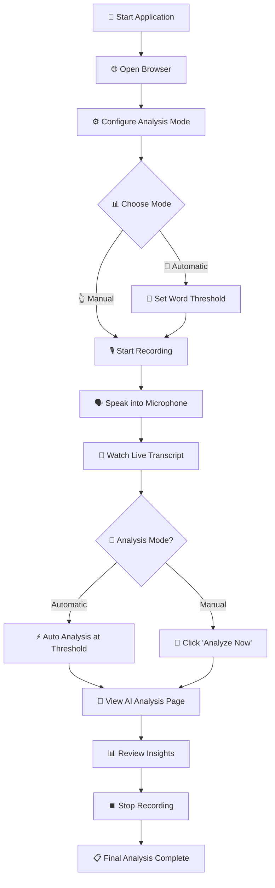

# 🎙️ AI IT Meeting Analyzer

<div align="center">


**Real-time meeting transcription and intelligent IT analysis**  
*Powered by Faster-Whisper (local) and Grok AI*

**🏢 Developed by [VisionRD](https://visionrd.ai)**

---

### 🚀 **[Live Demo](#-quick-start)** | 📖 **[Documentation](#-features)** | 🛠️ **[Installation](#-installation)** | 💡 **[Usage](#-how-to-use)**

</div>

---

## 🌟 **What Makes This Special?**

<table>
<tr>
<td width="50%">

### 🔒 **Privacy First**
- ✅ **100% Local Transcription** - Audio never leaves your device
- ✅ **No Cloud Storage** - Transcripts processed locally
- ✅ **Secure Analysis** - Only text sent to AI, never audio
- ✅ **Open Source** - Full transparency

</td>
<td width="50%">

### 🧠 **AI-Powered Intelligence**
- ✅ **IT-Focused Analysis** - Specialized for technical discussions
- ✅ **Real-time Processing** - Live transcription and analysis
- ✅ **Smart Recommendations** - Actionable insights and best practices
- ✅ **Issue Detection** - Identifies potential problems early

</td>
</tr>
</table>

---

## 🎯 **Features**

### 📱 **Dual-Page Interface**
<div align="center">

```mermaid
graph LR
    A[🎙️ Live Transcript Page] ---|Navigate|--- B[🤖 AI Analysis Page]
    A --> C[Real-time Recording]
    A --> D[Live Transcription]
    A --> E[Recording Controls]
    B --> F[Technical Analysis]
    B --> G[Issue Detection]
    B --> H[Recommendations]
```

</div>

| 🎙️ **Live Transcript Page** | 🤖 **AI Analysis Page** |
|---|---|
| • Real-time audio transcription | • Technical overview and insights |
| • Recording controls (Start/Stop/Analyze) | • Potential issues identification |
| • Analysis mode configuration | • Best practice recommendations |
| • Session management | • Clarifying questions |
| • Live word count and duration | • Action items and next steps |

### 🔧 **Analysis Modes**

<table>
<tr>
<td width="50%" align="center">

### 🤖 **Automatic Mode**


**Triggers analysis automatically**
- 📊 Set word threshold (200/300/500/1000)
- ⚡ Instant analysis when threshold reached
- 🔄 Continuous monitoring throughout meeting
- 🎯 Perfect for long meetings

</td>
<td width="50%" align="center">

### 👆 **Manual Mode**


**On-demand analysis control**
- 🎯 Click "Analyze Now" when ready
- 🎛️ Full control over timing
- 💡 Analyze specific discussion points
- 🎪 Perfect for structured meetings

</td>
</tr>
</table>

### 🎨 **User Interface**

<div align="center">

**🎙️ Live Transcript Page**
```
┌─────────────────────────────────────────────────────────────┐
│  🎙️ AI Meeting Analyzer                                     │
│  Real-time transcription powered by Faster-Whisper & Grok  │
│  ┌─────────────────┐ ┌─────────────────┐                   │
│  │ 🎙️ Live Transcript│ │ 🤖 AI Analysis  │                   │
│  │     (Active)     │ │                 │                   │
│  └─────────────────┘ └─────────────────┘                   │
├─────────────────────────────────────────────────────────────┤
│  ⚙️ Analysis Configuration                                  │
│  📊 Mode: 🤖 Automatic | 👆 Manual                          │
│  📝 Threshold: [200] [300] [500] [1000] words              │
├─────────────────────────────────────────────────────────────┤
│  🎛️ Controls: [🔴 Start] [⏹️ Stop] [🎯 Analyze] [🗑️ Clear]  │
├─────────────────────────────────────────────────────────────┤
│  📊 Live Transcript                                         │
│  ┌─────────────────────────────────────────────────────────┐ │
│  │ 📊 245 words • 12 segments • 3:42 duration             │ │
│  │                                                         │ │
│  │ "Let's discuss the cloud migration strategy for our    │ │
│  │  production environment. We need to consider security  │ │
│  │  implications and cost optimization..."                │ │
│  └─────────────────────────────────────────────────────────┘ │
└─────────────────────────────────────────────────────────────┘
```

**🤖 AI Analysis Page**
```
┌─────────────────────────────────────────────────────────────┐
│  🤖 AI Analysis                                             │
│  Intelligent meeting analysis powered by Grok AI           │
│  ┌─────────────────┐ ┌─────────────────┐                   │
│  │ 🎙️ Live Transcript│ │ 🤖 AI Analysis  │                   │
│  │                 │ │    (Active)     │                   │
│  └─────────────────┘ └─────────────────┘                   │
├─────────────────────────────────────────────────────────────┤
│  ✅ Analysis Complete! Latest analysis available            │
├─────────────────────────────────────────────────────────────┤
│  📊 Technical Overview                                      │
│  Discussion covers cloud migration with focus on security  │
│  and cost optimization. Key concerns around data privacy.  │
├─────────────────────────────────────────────────────────────┤
│  ⚠️ Potential Issues        │  ✅ Recommendations           │
│  • Data encryption gaps     │  • Implement zero-trust      │
│  • Cost monitoring missing  │  • Set up CloudWatch alerts  │
├─────────────────────────────────────────────────────────────┤
│  ❓ Questions               │  📋 Action Items              │
│  • Which compliance reqs?   │  1. Review security policies │
│  • Budget constraints?      │  2. Schedule architecture mtg │
└─────────────────────────────────────────────────────────────┘
```

</div>

---

## 🚀 **Quick Start**

### 📥 **Clone the Repository**

```bash
# Clone the specific branch with the latest features
git clone --branch feat/web_button https://github.com/visionrd-ai/ai-meeting-analyzer.git

# Navigate to the project directory
cd ai-meeting-analyzer
```

### ⚡ **One-Command Setup**

```bash
# Install dependencies and set up environment
pip install -r requirements.txt
```

### 🔑 **Configure API Key**

```bash
# Create environment file
echo "XAI_API_KEY=xai-your-api-key-here" > .env
```

> 🔗 **Get your API key:** [https://console.x.ai](https://console.x.ai)

### 🎉 **Launch the Application**

```bash
# Start the web application
python app.py
```

**🌐 Open in browser:** [http://localhost:5000](http://localhost:5000)

---

## 🛠️ **Installation**

### 📋 **System Requirements**

<table>
<tr>
<td width="25%" align="center">

**🐍 Python**  
  
*3.8 or higher*

</td>
<td width="25%" align="center">

**💾 Memory**  
  
*8GB recommended*

</td>
<td width="25%" align="center">

**🎤 Audio**  
  
*For input*

</td>
<td width="25%" align="center">

**🌐 Internet**  
  
*For AI analysis*

</td>
</tr>
</table>

### 🖥️ **Platform-Specific Setup**

<details>
<summary><b>🍎 macOS</b></summary>

```bash
# Install audio dependencies
brew install portaudio

# Install Python packages
pip install -r requirements.txt
```

</details>

<details>
<summary><b>🐧 Ubuntu/Debian</b></summary>

```bash
# Update package list
sudo apt-get update

# Install audio dependencies
sudo apt-get install portaudio19-dev python3-pyaudio

# Install Python packages
pip install -r requirements.txt
```

</details>

<details>
<summary><b>🪟 Windows</b></summary>

```bash
# PyAudio will be installed via pip automatically
# No additional system packages required

# Install Python packages
pip install -r requirements.txt
```

</details>

---

## 💡 **How to Use**

### 🎬 **Step-by-Step Workflow**

<div align="center">



</div>

### 📱 **Using the Interface**

#### 🎙️ **Live Transcript Page**

1. **🔧 Configure Analysis**
   - Choose between 🤖 **Automatic** or 👆 **Manual** mode
   - Set word threshold for automatic analysis (200/300/500/1000)
   - Or enter custom threshold (50-5000 words)

2. **🎬 Start Recording**
   - Click **🔴 Start Recording**
   - Grant microphone permissions if prompted
   - Speak clearly into your microphone

3. **👀 Monitor Progress**
   - Watch live transcription appear in real-time
   - See word count and duration update
   - For manual mode: Click **🎯 Analyze Now** when ready

#### 🤖 **AI Analysis Page**

1. **🔄 Navigate to Analysis**
   - Click **🤖 AI Analysis** in the navigation
   - Or open in a new tab: `http://localhost:5000/analysis`

2. **📊 View Results**
   - **Technical Overview**: Summary of discussion
   - **⚠️ Potential Issues**: Problems identified
   - **✅ Recommendations**: Best practices and solutions
   - **❓ Questions**: Clarifying questions for missing details
   - **📋 Action Items**: Next steps and tasks

3. **🔄 Stay Updated**
   - Page auto-refreshes during active recording
   - Click **🔄 Refresh Analysis** for latest results
   - Analysis updates in real-time during automatic mode

### 🎯 **Pro Tips**

<table>
<tr>
<td width="50%">

### 🎤 **Recording Best Practices**
- 🗣️ **Speak clearly** at normal volume
- 🔇 **Minimize background noise**
- 📏 **Stay consistent distance** from microphone
- ⏸️ **Pause briefly** between speakers
- 🎯 **Use technical terms** - AI understands IT jargon

</td>
<td width="50%">

### 🤖 **Analysis Optimization**
- 📊 **Automatic mode**: Use 200-300 words for frequent updates
- 👆 **Manual mode**: Analyze after key discussion points
- 🔄 **Multiple tabs**: Keep both pages open simultaneously
- 📱 **Mobile friendly**: Works on tablets and phones
- 💾 **Session persistence**: Data saved across page refreshes

</td>
</tr>
</table>

---

## 🧠 **What the AI Analyzes**

### 🎯 **IT-Focused Intelligence**

<div align="center">

| 📊 **Analysis Category** | 🔍 **What It Identifies** | 💡 **Example Output** |
|---|---|---|
| **📋 Technical Overview** | Discussion summary and key topics | *"Team discussed Kubernetes migration with focus on security and scalability"* |
| **⚠️ Potential Issues** | Security risks, misconfigurations, bottlenecks | *"No mention of backup strategy for database migration"* |
| **✅ Recommendations** | Best practices and specific solutions | *"Implement blue-green deployment for zero-downtime migration"* |
| **❓ Clarifying Questions** | Missing details and important considerations | *"What's the expected traffic load during peak hours?"* |
| **📋 Action Items** | Concrete next steps and assignments | *"Schedule security review meeting with InfoSec team"* |

</div>

### 🏗️ **IT Domains Covered**

<table>
<tr>
<td width="33%">

**☁️ Cloud Services**
- AWS, Azure, GCP
- Migration strategies
- Cost optimization
- Service selection

</td>
<td width="33%">

**🐳 DevOps & Containers**
- Kubernetes orchestration
- Docker containerization
- CI/CD pipelines
- Infrastructure as Code

</td>
<td width="33%">

**🔒 Security & Compliance**
- Cybersecurity best practices
- Compliance requirements
- Risk assessment
- Access management

</td>
</tr>
<tr>
<td width="33%">

**🌐 Networking**
- Network architecture
- Load balancing
- DNS configuration
- VPN setup

</td>
<td width="33%">

**🗄️ Databases**
- Database design
- Performance optimization
- Backup strategies
- Migration planning

</td>
<td width="33%">

**🏗️ Architecture**
- System design
- Microservices
- Scalability planning
- Performance tuning

</td>
</tr>
</table>

---

## 💰 **Cost Analysis**

### 💸 **Transparent Pricing**

<table>
<tr>
<td width="50%" align="center">

### 🆓 **Transcription (Faster-Whisper)**


- ✅ **$0.00** - Completely free
- 🔒 **100% Local** - No internet required
- 🚫 **No limits** - Unlimited usage
- 🔐 **Private** - Audio never leaves device

</td>
<td width="50%" align="center">

### 🧠 **AI Analysis (Grok API)**


- 💰 **~$0.0002** per 1,000 tokens
- 📊 **10-min meeting**: ~$0.002
- 🎁 **$25 free credits** = 10,000+ meetings
- ⚡ **Fast model**: grok-4-fast-reasoning

</td>
</tr>
</table>

### 📈 **Usage Examples**

| Meeting Duration | Estimated Cost | Free Credit Coverage |
|---|---|---|
| 10 minutes | $0.002 | 12,500 meetings |
| 30 minutes | $0.006 | 4,167 meetings |
| 1 hour | $0.012 | 2,083 meetings |
| 2 hours | $0.024 | 1,042 meetings |

---

## 🔧 **Configuration**

### 🎚️ **Audio Settings**

<details>
<summary><b>🎤 Customize Audio Processing</b></summary>

Edit `audio_processor_faster_whisper.py`:

```python
# Audio processing configuration
CHUNK_DURATION_SECONDS = 2    # Process audio every 2 seconds
OVERLAP_SECONDS = 1           # 1-second overlap for continuity
WHISPER_MODEL_SIZE = "tiny"   # Options: tiny, base, small, medium, large
DEVICE = "cpu"                # Use "cuda" for GPU acceleration

# Audio quality settings
SAMPLE_RATE = 16000          # Audio sample rate
CHANNELS = 1                 # Mono audio
```

**🎯 Model Size Guide:**
- `tiny`: Fastest, least accurate (39 MB)
- `base`: Good balance (74 MB)
- `small`: Better accuracy (244 MB)
- `medium`: High accuracy (769 MB)
- `large`: Best accuracy (1550 MB)

</details>

### 🧠 **AI Analysis Settings**

<details>
<summary><b>🤖 Customize AI Behavior</b></summary>

Edit `summarizer.py`:

```python
# Analysis configuration
DEFAULT_WORDS_PER_ANALYSIS = 200        # Default word threshold
DEFAULT_WORDS_PER_ROLLING_SUMMARY = 300 # Rolling summary interval
MAX_PRIOR_SUMMARY_WORDS = 1000          # Context window size
GROK_MODEL = "grok-4-fast-reasoning"    # Grok model

# Analysis prompts (customize for your domain)
SYSTEM_PROMPT = """You are an expert IT consultant analyzing meeting discussions..."""
```

**🎯 Available Models:**
- `grok-4-fast-reasoning`: Fast, cost-effective
- `grok-4`: Higher accuracy, more expensive

</details>

---

## 🛠️ **Troubleshooting**

### 🎤 **Audio Issues**

<details>
<summary><b>🔇 No Audio/Microphone Not Working</b></summary>

**🔍 Diagnosis Steps:**
1. Check if other apps can access microphone
2. Verify microphone permissions for terminal/Python
3. Test system audio levels
4. Ensure no other app is using microphone

**🔧 Solutions:**
```bash
# Test microphone access
python -c "import pyaudio; p = pyaudio.PyAudio(); print('Microphone available')"

# List available audio devices
python -c "import pyaudio; p = pyaudio.PyAudio(); [print(f'{i}: {p.get_device_info_by_index(i)}') for i in range(p.get_device_count())]"
```

**🍎 macOS Specific:**
- Go to System Preferences → Security & Privacy → Microphone
- Enable access for Terminal or your Python environment

**🪟 Windows Specific:**
- Go to Settings → Privacy → Microphone
- Enable microphone access for apps

</details>

<details>
<summary><b>📝 No Transcription Appearing</b></summary>

**🔍 Common Causes:**
- Speaking too quietly
- Background noise interference
- Microphone sensitivity issues
- Wrong audio device selected

**🔧 Solutions:**
1. **Speak clearly** at normal conversation volume
2. **Reduce background noise** (close windows, turn off fans)
3. **Test audio processor** directly:
   ```bash
   python audio_processor_faster_whisper.py
   ```
4. **Check audio levels** in system settings

</details>

### 🌐 **API Connection Issues**

<details>
<summary><b>🔑 API Key Problems</b></summary>

**🔍 Symptoms:**
- "Missing XAI_API_KEY" error
- Analysis not working
- Connection timeouts

**🔧 Solutions:**
1. **Verify .env file exists** in project root
2. **Check API key format**:
   ```bash
   # Correct format
   XAI_API_KEY=xai-1234567890abcdef...
   
   # No quotes, no spaces
   ```
3. **Test API key**:
   ```bash
   curl -H "Authorization: Bearer xai-your-key" https://api.x.ai/v1/models
   ```
4. **Get new API key**: [https://console.x.ai](https://console.x.ai)

</details>

<details>
<summary><b>🐌 Slow Analysis</b></summary>

**🔍 Possible Causes:**
- Large transcript size
- Network connectivity issues
- API rate limiting

**🔧 Optimizations:**
1. **Use smaller word thresholds** (200-300 words)
2. **Check internet connection** stability
3. **Monitor API status**: [https://status.x.ai](https://status.x.ai)
4. **Consider manual mode** for better control

</details>

### 🖥️ **Application Issues**

<details>
<summary><b>🔄 Page Not Refreshing</b></summary>

**🔧 Solutions:**
1. **Hard refresh**: Ctrl+F5 (Windows) or Cmd+Shift+R (Mac)
2. **Clear browser cache**
3. **Check browser console** for JavaScript errors (F12)
4. **Restart application**:
   ```bash
   # Stop with Ctrl+C, then restart
   python app.py
   ```

</details>

---

## 📁 **Project Structure**

```
ai-meeting-analyzer/
├── 📄 app.py                              # 🌐 Flask web application
├── 📁 templates/
│   ├── 📄 index.html                      # 🎙️ Live Transcript page
│   ├── 📄 analysis.html                   # 🤖 AI Analysis page
│   └── 📄 index_obaid.html                # 🔄 Legacy combined interface
├── 📄 audio_processor_faster_whisper.py   # 🎤 Audio capture & transcription
├── 📄 summarizer.py                       # 🧠 Grok AI analysis engine
├── 📄 requirements.txt                    # 📦 Python dependencies
├── 📄 .env                                # 🔑 API keys (create this)
├── 📄 README.md                           # 📖 This documentation
└── 📁 static/                             # 🎨 Web assets (auto-generated)
```

### 🔧 **Core Components**

| Component | Purpose | Technology |
|---|---|---|
| **🌐 Flask App** | Web interface and API endpoints | Python Flask |
| **🎤 Audio Processor** | Real-time speech-to-text | Faster-Whisper |
| **🧠 AI Analyzer** | Intelligent meeting analysis | Grok AI API |
| **📱 Frontend** | Responsive web interface | HTML5, CSS3, JavaScript |
| **💾 Storage** | Session persistence | Local file system |

---

## 🔒 **Privacy & Security**

### 🛡️ **Privacy Guarantees**

<table>
<tr>
<td width="50%">

### 🔐 **What Stays Local**
- ✅ **Audio recordings** - Never transmitted
- ✅ **Raw audio data** - Processed locally only
- ✅ **Whisper models** - Downloaded and run locally
- ✅ **Session data** - Stored on your device
- ✅ **API keys** - Stored in local .env file

</td>
<td width="50%">

### 🌐 **What Goes to Cloud**
- 📝 **Transcript text only** - For AI analysis
- 🧠 **Analysis requests** - To Grok AI API
- ❌ **No audio files** - Never uploaded
- ❌ **No personal data** - Only meeting content
- ❌ **No permanent storage** - Not saved by API

</td>
</tr>
</table>

### 🔒 **Security Best Practices**

1. **🔑 API Key Security**
   ```bash
   # Add .env to .gitignore
   echo ".env" >> .gitignore
   
   # Set restrictive permissions
   chmod 600 .env
   ```

2. **🌐 Network Security**
   - All API calls use HTTPS encryption
   - No sensitive data in URLs or headers
   - API keys transmitted securely

3. **💾 Local Data**
   - Temporary files cleaned on exit
   - No permanent audio storage
   - Session data can be cleared anytime

---

## 🤝 **Contributing**

### 🚀 **Get Involved**

We welcome contributions from the community! Here's how you can help:

<table>
<tr>
<td width="33%" align="center">

### 🐛 **Report Issues**


Found a bug? Have a suggestion?
[Open an issue](https://github.com/visionrd-ai/ai-meeting-analyzer/issues)

</td>
<td width="33%" align="center">

### 🔧 **Submit PRs**


Want to contribute code?
[Submit a pull request](https://github.com/visionrd-ai/ai-meeting-analyzer/pulls)

</td>
<td width="33%" align="center">

### ⭐ **Star the Repo**


Like the project?
[Give us a star!](https://github.com/visionrd-ai/ai-meeting-analyzer)

</td>
</tr>
</table>

### 🛠️ **Development Setup**

```bash
# Fork and clone the repository
git clone https://github.com/YOUR-USERNAME/ai-meeting-analyzer.git
cd ai-meeting-analyzer

# Create virtual environment
python -m venv venv
source venv/bin/activate  # On Windows: venv\Scripts\activate

# Install development dependencies
pip install -r requirements.txt
pip install -r requirements-dev.txt  # If available

# Run tests
python -m pytest

# Start development server
python app.py
```

---

## 📞 **Support**

### 🆘 **Need Help?**

<div align="center">

| 📖 **Documentation** | 🐛 **Issues** | 💬 **Discussions** | 🏢 **VisionRD** |
|---|---|---|---|
| [Read the docs](#-how-to-use) | [Report bugs](https://github.com/visionrd-ai/ai-meeting-analyzer/issues) | [Join discussions](https://github.com/visionrd-ai/ai-meeting-analyzer/discussions) | [Visit VisionRD](https://visionrd.ai) |

</div>

### 🔍 **Before Asking for Help**

1. ✅ **Check this README** - Most questions are answered here
2. ✅ **Review troubleshooting** - Common issues and solutions
3. ✅ **Search existing issues** - Your question might be answered
4. ✅ **Test components individually** - Isolate the problem
5. ✅ **Check API status** - [https://status.x.ai](https://status.x.ai)

### 📋 **When Reporting Issues**

Please include:
- 🖥️ **Operating system** and version
- 🐍 **Python version** (`python --version`)
- 📦 **Package versions** (`pip list`)
- 🔍 **Error messages** (full stack trace)
- 🎯 **Steps to reproduce** the issue
- 📊 **Expected vs actual behavior**

---

## 📜 **License**

<div align="center">


This project is licensed under the **MIT License** - see the [LICENSE](LICENSE) file for details.

**🎉 Free to use, modify, and distribute!**

</div>

---

## 🙏 **Acknowledgments**

### 🌟 **Powered By**

<table>
<tr>
<td width="25%" align="center">

**🎤 Faster-Whisper**  
  
*Local speech-to-text*

</td>
<td width="25%" align="center">

**🧠 Grok AI**  
  
*Intelligent analysis*

</td>
<td width="25%" align="center">

**🌐 Flask**  
  
*Web application*

</td>
<td width="25%" align="center">

**🐍 Python**  
  
*Core technology*

</td>
</tr>
</table>

### 🏢 **About VisionRD**

<div align="center">

**[VisionRD](https://visionrd.ai)** is a leading AI solutions company specializing in intelligent automation and data analysis tools for enterprises.

*Building the future of AI-powered productivity tools.*

---

**Made with ❤️ by the VisionRD Team**

[](https://visionrd.ai)

</div>

---

<div align="center">

### 🚀 **Ready to Transform Your Meetings?**

**[⬇️ Clone Now](#-quick-start)** | **[🌟 Star on GitHub](https://github.com/visionrd-ai/ai-meeting-analyzer)** | **[📖 Read Docs](#-features)**

---

*Transform your IT meetings from chaotic discussions into structured, actionable insights with the power of AI.*

</div>